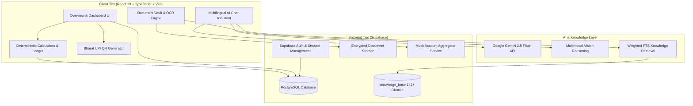

<div align="center">

# 🇮🇳 UdyamAI (उद्यम AI)
### The Intelligent AI Business Companion & Financial Operating System for Indian MSMEs

[](https://react.dev/)
[](https://www.typescriptlang.org/)
[](https://vitejs.dev/)
[](https://aistudio.google.com/)
[](https://supabase.com/)
[](https://tailwindcss.com/)

**Empowering 63+ million Indian micro and small enterprises with multimodal fraud protection, vernacular AI advisory, grounded government scheme discovery, and deterministic financial management.**

---


</div>

---

## 📌 Table of Contents
1. [Executive Summary](#-executive-summary)
2. [The Problem: Challenges Facing Indian MSMEs](#-the-problem-challenges-facing-indian-msmes)
3. [The Solution: How UdyamAI Works](#-the-solution-how-udyamai-works)
4. [Core Features & Innovations](#-core-features--innovations)
5. [System Architecture](#-system-architecture)
6. [Judges' Quickstart & Demo Guide](#-judges-quickstart--demo-guide)
7. [Tech Stack](#-tech-stack)
8. [Database Schema & Security](#-database-schema--security)
9. [Unique Engineering & Design Decisions](#-unique-engineering--design-decisions)
10. [Roadmap](#-roadmap)

---

## 💡 Executive Summary

Micro, Small, and Medium Enterprises (MSMEs) form the backbone of India's economy—contributing **~30% of GDP** and employing over **110 million people**. However, the vast majority of micro-entrepreneurs (kirana store owners, small manufacturers, boutique owners, repair shops) operate with paper khata ledgers and zero financial advisory.

**UdyamAI** is built specifically for Indian entrepreneurs. It merges **Google Gemini's multimodal reasoning** with a **grounded scheme knowledge base (RAG)**, **deterministic financial mathematics**, and a **mock RBI Account Aggregator (AA) feed** to provide an all-in-one business operating system.

---

## 🛑 The Problem: Challenges Facing Indian MSMEs

| Pain Point | The Reality on the Ground |
|---|---|
| **🚨 Rampant UPI Payment Scams** | Fraudsters flash fake Paytm/PhonePe/GPay payment success screens or play spoofed voice box audio. Small merchants lose goods without ever receiving the funds. |
| **📑 Subsidy & Scheme Opacity** | Government schemes (PMEGP, Mudra, CGTMSE, SISFS, Genesis) offer thousands of crores in collateral-free loans and 15–35% subsidies, but guidelines are buried in 80-page bureaucratic PDFs. |
| **🗣️ Language & Terminology Barrier** | Most enterprise software is English-first and heavy with corporate jargon. MSME owners operate in Hindi, Telugu, Tamil, Marathi, and Hinglish. |
| **🧮 Financial Literacy & Arithmetic Gaps** | Calculating break-even sales, profit margins, or runway requires financial modeling skills. Micro-businesses often misprice products and run out of working capital. |
| **🗃️ Fragmented Record-Keeping** | Invoices, GST numbers, and Udyam certificates are scattered across WhatsApp chats, physical paper, or lost entirely. |

---

## ✨ The Solution: How UdyamAI Works

UdyamAI acts as a 24/7 digital CFO, compliance officer, and security shield:

1. **Catches Fake UPI Scams Instantly**: Upload any suspicious payment screenshot or PDF; UdyamAI inspects visual artifacts, verifies transaction details, and checks against real bank feeds via Account Aggregator.
2. **Translates Bureaucracy into Approvals**: Uses Retrieval-Augmented Generation (RAG) over official gazettes to analyze business profile eligibility and provide a step-by-step application roadmap.
3. **Speaks 11 Indic Languages**: Natural voice and text conversations in English, Hindi, Hinglish, Telugu, Tamil, Kannada, Marathi, Bengali, Gujarati, Malayalam, and Punjabi.
4. **Guarantees Mathematical Accuracy**: While generative AI assists with strategy and conversational support, all break-even, runway, profit margin, and ledger totals are calculated deterministically (zero AI arithmetic hallucinations).
5. **Unified Merchant Dashboard**: Financial records, compliance tasks, QR generation, and loan tracking organized in a clean, print-shop warm ledger design.

---

## 🚀 Core Features & Innovations

### 1. 🛡️ Multimodal Fake UPI & Fraud Shield
- **Visual & Text Anomaly Detection**: Analyzes uploaded payment screenshots for font mismatches, irregular alignment, missing UTR numbers, or spoofed UI elements from known fake APK generator apps.
- **Urgent Fraud Protocol**: Triggers immediate high-priority warning headers (`🚨 FRAUD WARNING: Do NOT trust this screenshot. Money has NOT been received.`) whenever red flags are detected.
- **Mock Account Aggregator (AA) Cross-Verification**: Prompts users to verify live bank transactions via the Account Aggregator network rather than relying on unverified SMS or client-rendered screenshots.

### 2. 🌐 Multilingual AI Business Advisor (Gemini 2.5 Flash)
- Grounded on official MSME documents (PMEGP, Mudra, Startup India Seed Fund, Genesis, BIG).
- Instant language switching across **11 languages** with preserved business context.
- Injects personalized business parameters (turnover, sector, vintage, registration status) into every prompt for tailored advice.

### 3. 📊 Double-Entry-Style Financial Ledger & Deterministic Tools
- **Live Home Dashboard Ledger**: Quick income/expense recording with real-time computation of Total Income, Total Expenses, and Net Balance.
- **Break-Even Calculator**: Computes required unit sales and minimum revenue given fixed costs and variable margins.
- **Profit Margin Calculator**: Reveals true gross margin, net margin, and markup percentage.
- **Cash Runway Calculator**: Models survival runway based on current cash reserves and monthly burn rate.

### 4. 🎯 Automated Scheme Fit-Check Engine
- Evaluates MSME profiles against complex scheme criteria (manufacturing vs. service, urban vs. rural, project cost thresholds, special category concessions for women/SC/ST/OBC/NER).
- Provides instant match statuses: `Eligible`, `Potential Match`, or `Missing Requirements` with actionable suggestions to bridge gaps.

### 5. 📱 Dynamic Bharat UPI QR Generator
- Generates compliant UPI QR codes with custom merchant VPAs, payee business names, and dynamic transaction amounts.
- Includes live preview, quick amount presets (₹100, ₹500, ₹2,000), and instant high-resolution PNG download for counter display.

### 6. 📂 Smart Document Vault & OCR
- Secure cloud storage partitioned by document category (Identity, Registration, Tax, Financial).
- In-browser PDF and image viewer with automated OCR text extraction.

### 7. 📋 Interactive Kanban Application & Task Tracker
- Tracks loan and scheme submissions through stages: *Draft*, *Submitted*, *Under Review*, and *Approved*.
- Keeps entrepreneurs ahead of compliance deadlines (GST filings, Udyam updates, renewal dates).

---

## 🏗️ System Architecture



---

## 🧪 Judges' Quickstart & Demo Guide

Follow these steps to run UdyamAI locally in under 3 minutes:

### Prerequisites
- Node.js 18+ or 20+
- npm 9+
- A Google Gemini API key ([Get one free at Google AI Studio](https://aistudio.google.com/app/apikey))

### 1. Clone & Install
```bash
git clone https://github.com/your-repo/udyam-ai.git
cd udyam-ai
npm install
```

### 2. Configure Environment Variables
Copy the template and fill in your Gemini and Supabase credentials:
```bash
cp .env.example .env
```
Ensure your `.env` contains:
```env
VITE_SUPABASE_URL=https://hatdanzozmeyccgophbh.supabase.co
VITE_SUPABASE_ANON_KEY=your_supabase_anon_key
VITE_GEMINI_API_KEY=your_gemini_api_key
```

### 3. Run Development Server
```bash
npm run dev
```
Open **`http://localhost:5173`** in your browser.

---

### 🎯 Key Demo Scenarios to Test

| Scenario | What to Do | Expected Result |
|---|---|---|
| **1. Fake UPI Scam Test** | Go to **AI Assistant**, upload a payment screenshot (or type: *"User says they sent ₹5,000 via UPI and showed me a screenshot, but I got no bank SMS"*). | Gemini triggers the **🚨 FRAUD WARNING protocol**, warns against trusting screenshots alone, and suggests verifying the connected bank statement. |
| **2. Multilingual Advisory** | In **AI Assistant**, select **Hindi (हिंदी)** or **Telugu (తెలుగు)** from the language dropdown. Ask: *"मेरे ढाबे के लिए कौन सी सरकारी लोन स्कीम सबसे अच्छी है?"* | Gemini responds in fluent, culturally accurate native script recommending PMEGP / Mudra schemes based on profile data. |
| **3. Grounded Scheme Search** | Navigate to **Funding** and search for *"PMEGP"* or *"Genesis"*. Click **Check Fit**. | Evaluates your profile parameters against scheme rules and shows matching criteria breakdown. |
| **4. Live Ledger on Home** | On **Overview (Home)**, scroll to **Financial Records**, click **+ Add entry**, record an expense (e.g. ₹4,200 for Inventory). | The summary cards (Total Income, Total Expenses, Net) update instantaneously and the top Health Indicator syncs. |
| **5. UPI QR Code Creation** | Click **Create QR** in Quick Actions, enter an amount (e.g. ₹750), and preview the generated Bharat UPI QR ready for customer scanning. | High-resolution canvas/SVG QR generated immediately with download options. |

---

## 🛠️ Tech Stack

| Layer | Technologies | Purpose |
|---|---|---|
| **Frontend Framework** | React 19, TypeScript 6, Vite 8 | Ultra-fast HMR, strict type safety, zero build lag |
| **Styling & Design System** | Tailwind CSS v4, Custom CSS Tokens | Bespoke warm ledger aesthetic tailored for Indian merchants |
| **AI & LLM** | Google Gemini 2.5 Flash / Gemini Vision | High-speed multimodal understanding, OCR analysis, 11 Indic languages |
| **Knowledge Base (RAG)** | PostgreSQL Full-Text Search (`tsvector`, GIN indexes) | Sub-millisecond retrieval across official government guidelines |
| **Backend & Storage** | Supabase (PostgreSQL 15, Auth, Storage) | Relational integrity, Row Level Security (RLS), document vault |
| **Banking Demo** | Mock Account Aggregator (PL/pgSQL functions) | Live account connectivity and statement cross-verification |
| **Icons & Media** | Lucide React, HTML5 Canvas QR engine | Accessible UI icons and dynamic QR generation |

---

## 🗄️ Database Schema & Security

All user tables implement strict **Supabase Row-Level Security (RLS)** ensuring users only access their own records:

- **`business_profiles`**: Business name, Udyam registration number, GSTIN, sector, turnover, entity stage, state/district.
- **`financial_records`**: Personal income/expense ledger with category classification, recurring flags, and timestamps.
- **`knowledge_base`**: 142+ indexed chunks of verified government schemes with generated weighted search vectors (`fts`).
- **`applications`**: Funding and loan tracking pipelines mapped to opportunities and statuses.
- **`tasks`**: Action items, statutory filing reminders, and compliance checklists.
- **`documents`**: Metadata for uploaded receipts, tax returns, and identity proofs.
- **`mock_bank_accounts` & `mock_bank_transactions`**: Account Aggregator demo feeds used for payment cross-verification.

---

## 🧠 Unique Engineering & Design Decisions

### 1. Zero-Hallucination Deterministic Math
Large Language Models are notorious for arithmetic inaccuracies. In UdyamAI:
- **AI explains and guides** strategy and compliance.
- **Deterministic TypeScript algorithms calculate** break-even points, profit margins, runway projections, and ledger balances.

### 2. Multi-Tiered Fraud Shield
Rather than solely relying on text prompts, UdyamAI uses a 3-layer verification model:
1. Multimodal OCR + visual artifact inspection of the transaction proof.
2. In-context fraud detection rules tuned for Indian UPI payment spoofers.
3. Cross-referencing against the merchant's real bank ledger via Account Aggregator.

### 3. Print-Shop / Warm Ledger Aesthetic
Unlike generic corporate SaaS dashboards with dark glassmorphism and neon gradients, UdyamAI is styled with warm parchment tones (`#f3ede3`, `#fffbf5`), classic editorial serif typography (`Fraunces`), and crisp high-contrast green/red ledger highlights—creating an immediate feeling of trustworthiness and familiarity for Indian business owners.

---

## 🗺️ Roadmap

- [x] Multilingual AI companion with Gemini 2.5 Flash.
- [x] Full-text RAG knowledge base for top Indian MSME schemes.
- [x] Multimodal fake UPI screenshot fraud detector.
- [x] Deterministic financial calculators and live home ledger.
- [x] Dynamic Bharat UPI QR generator.
- [ ] **WhatsApp Business API Gateway**: Enable micro-merchants to record transactions and check fraud via simple WhatsApp voice and image notes.
- [ ] **Production Account Aggregator Integration**: Connect to licensed Sahamati AA networks (Setu, OneMoney, Finvu) for real-time bank statement verification.
- [ ] **Direct Udyam & GSTN API Verification**: 1-click automated business verification via official sandbox gateways.

---

<div align="center">

**Built with pride for Indian Entrepreneurs at the Hackathon.**

</div>
